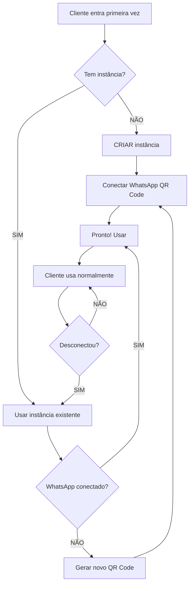

# 🏗️ Gestão de Instâncias - Evolution API

## 📋 Regra de Ouro

```
1 CLIENTE = 1 INSTÂNCIA (PARA SEMPRE)
```

**NUNCA** crie múltiplas instâncias para o mesmo cliente!

---

## ✅ Como Funciona Corretamente

### Cenário: 100 Clientes

```
Cliente 1 → instance_a1b2c3d4 (criada 1x, usada sempre)
Cliente 2 → instance_b2c3d4e5 (criada 1x, usada sempre)
Cliente 3 → instance_c3d4e5f6 (criada 1x, usada sempre)
...
Cliente 100 → instance_z9y8x7w6 (criada 1x, usada sempre)

TOTAL: 100 instâncias (limite do Evolution)
```

### Fluxo de Vida de uma Instância



---

## 🔢 Limites do Evolution API

### Configuração padrão:
```bash
# .env da Evolution API
INSTANCE_MAX=100  # Máximo de instâncias simultâneas
```

### O que acontece se ultrapassar:
- ❌ Erro ao criar nova instância
- ❌ "Maximum instances reached"
- ❌ Clientes novos não conseguem conectar

### Como aumentar o limite:
```bash
# Edite o .env
INSTANCE_MAX=500  # Ou qualquer número que precisar

# Reinicie a Evolution API
docker-compose restart
```

**Importante:** Mais instâncias = Mais recursos (RAM, CPU)
- 100 instâncias ≈ 4GB RAM
- 500 instâncias ≈ 16GB RAM
- 1000 instâncias ≈ 32GB RAM

---

## 🛡️ Proteções Implementadas no Sistema

### 1. Verificação Automática ao Abrir Página

```javascript
// Quando o cliente abre a página do WhatsApp
useEffect(() => {
  verificarInstanciaExiste() // Checa se já tem instância
}, [])

const verificarInstanciaExiste = async () => {
  const todasInstancias = await fetch('/instance/fetchInstances')
  const minhaInstancia = todasInstancias.find(i => i.name === 'instance_abc123')

  if (minhaInstancia) {
    setInstanceExists(true)  // ✅ Já existe
    // Mostra botão "Gerar QR Code" (não "Criar")
  } else {
    setInstanceExists(false) // ❌ Não existe
    // Mostra botão "Criar e Conectar"
  }
}
```

### 2. Proteção contra Criação Duplicada

```javascript
const criarInstancia = async () => {
  // PROTEÇÃO: Se já existe, não cria nova!
  if (instanceExists) {
    console.log('⚠️ Instância já existe! Conectando sem criar nova...')
    conectarWhatsApp() // Apenas conecta
    return // Sai da função sem criar
  }

  // Se chegou aqui, realmente não existe → Cria
  await fetch('/instance/create', { ... })
}
```

### 3. Fallback no Erro 403

```javascript
// Se tentar criar e der 403 (Forbidden)
// Pode ser que a instância já existe mas não foi detectada
if (response.status === 403) {
  console.log('⚠️ Erro 403 - Tentando conectar sem criar...')
  conectarWhatsApp() // Tenta conectar
  return
}
```

---

## 📊 Situações Comuns

### Situação 1: Cliente Conecta pela Primeira Vez

```
1. Cliente entra no sistema
2. Sistema verifica → Não tem instância
3. Mostra botão "Criar e Conectar WhatsApp"
4. Cliente clica
5. Sistema CRIA instance_a1b2c3d4
6. Mostra QR Code
7. Cliente escaneia
8. WhatsApp conectado ✅
9. Instância salva no Evolution
```

**Resultado:** 1 instância criada

---

### Situação 2: Cliente Fecha o Navegador e Volta

```
1. Cliente fecha navegador
2. Cliente abre navegador depois
3. Sistema verifica → TEM instance_a1b2c3d4
4. Mostra "WhatsApp Conectado ✅" (se ainda conectado)
   OU "Gerar QR Code" (se desconectou)
5. Cliente NÃO precisa criar nova instância
```

**Resultado:** 0 instâncias criadas (usa a mesma)

---

### Situação 3: WhatsApp Desconecta (celular offline, etc.)

```
1. WhatsApp desconecta (celular sem internet, etc.)
2. Cliente entra no sistema
3. Sistema verifica → TEM instance_a1b2c3d4 (existe mas offline)
4. Mostra "Gerar QR Code"
5. Cliente clica
6. Sistema usa a MESMA instance_a1b2c3d4
7. Gera novo QR Code para reconectar
8. Cliente escaneia
9. Reconectado ✅
```

**Resultado:** 0 instâncias criadas (reconecta a mesma)

---

### Situação 4: Cliente Troca de Número de WhatsApp

```
1. Cliente quer usar outro número
2. Você precisa DELETAR a instância antiga
3. Sistema verifica → Não tem mais instância
4. Cliente cria nova com novo número
```

**Como deletar instância antiga:**

**Via Sistema (TODO - implementar):**
- Botão "Desconectar e Deletar Instância"

**Via API manualmente:**
```bash
curl -X DELETE https://sua-evolution-api.com/instance/delete/instance_a1b2c3d4 \
  -H "apikey: SUA_GLOBAL_API_KEY"
```

**Via Supabase:**
```sql
-- Limpar configurações do cliente
DELETE FROM config WHERE user_id = 'id-do-cliente';
```

**Resultado:** 1 instância deletada, 1 instância nova criada (total: 1)

---

## 🧮 Cálculo para 100 Clientes

### Cenário Ideal (Sistema implementado corretamente):

```
Mês 1:
  - 100 clientes conectam pela primeira vez
  - 100 instâncias criadas
  - Total: 100 instâncias ✅

Mês 2:
  - 50 clientes desconectam e reconectam
  - 0 instâncias novas (reconectam nas mesmas)
  - Total: 100 instâncias ✅

Mês 3:
  - 10 clientes trocam de número
  - 10 instâncias deletadas
  - 10 instâncias novas criadas
  - Total: 100 instâncias ✅

Ano 1:
  - Máximo de instâncias simultâneas: 100 ✅
```

### Cenário Ruim (SEM proteção):

```
Mês 1:
  - 100 clientes conectam
  - 100 instâncias criadas
  - Total: 100 instâncias

Mês 2:
  - 50 clientes desconectam
  - 50 clientes criam NOVA instância (ERRADO!)
  - Total: 150 instâncias ❌ (passou do limite de 100)

Resultado: Sistema trava, novos clientes não conseguem conectar!
```

---

## 🗑️ Limpeza de Instâncias Órfãs

Com o tempo, podem sobrar instâncias antigas sem uso. Recomendado limpar periodicamente.

### Script de Limpeza (Manual):

```javascript
// listar-instancias-orfas.js
const fetch = require('node-fetch')

async function listarInstanciasOrfas() {
  // 1. Buscar todas as instâncias no Evolution
  const response = await fetch('https://sua-evolution-api.com/instance/fetchInstances', {
    headers: { 'apikey': 'SUA_GLOBAL_API_KEY' }
  })
  const instancias = await response.json()

  // 2. Buscar todos os user_id ativos no Supabase
  // (você precisa implementar)
  const usuariosAtivos = ['user1', 'user2', 'user3', ...] // IDs dos usuários ativos

  // 3. Verificar quais instâncias não pertencem a usuários ativos
  const orfas = instancias.filter(inst => {
    const userId = inst.instanceName.replace('instance_', '')
    return !usuariosAtivos.includes(userId)
  })

  console.log('Instâncias órfãs:', orfas.length)
  orfas.forEach(inst => {
    console.log(`- ${inst.instanceName} (última conexão: ${inst.lastConnect})`)
  })
}
```

### Deletar Instâncias Órfãs:

```bash
# Via API Evolution
curl -X DELETE https://sua-evolution-api.com/instance/delete/instance_a1b2c3d4 \
  -H "apikey: SUA_GLOBAL_API_KEY"
```

**Recomendação:** Fazer limpeza mensal das instâncias desconectadas há mais de 30 dias.

---

## 📈 Monitoramento

### Verificar quantas instâncias ativas:

```bash
curl -X GET https://sua-evolution-api.com/instance/fetchInstances \
  -H "apikey: SUA_GLOBAL_API_KEY" | jq 'length'
```

### Ver status de todas:

```bash
curl -X GET https://sua-evolution-api.com/instance/fetchInstances \
  -H "apikey: SUA_GLOBAL_API_KEY" | jq '.[] | {name: .instanceName, state: .state}'
```

### Alertar quando chegar perto do limite:

```javascript
const instancias = await fetch('/instance/fetchInstances')
const total = instancias.length
const limite = 100

if (total >= limite * 0.9) { // 90% do limite
  console.warn(`⚠️ Atenção! ${total}/${limite} instâncias (${(total/limite*100)}%)`)
  // Enviar email/notificação
}
```

---

## 🎯 Boas Práticas

### ✅ FAÇA:
1. **1 cliente = 1 instância** (sempre)
2. **Verifique se existe antes de criar**
3. **Reutilize instâncias existentes** ao reconectar
4. **Delete instâncias** de clientes inativos/cancelados
5. **Monitore o total** de instâncias periodicamente
6. **Configure limite adequado** para sua demanda
7. **Faça limpeza mensal** de instâncias órfãs

### ❌ NÃO FAÇA:
1. Criar nova instância a cada conexão
2. Criar múltiplas instâncias para o mesmo cliente
3. Deixar instâncias antigas sem deletar
4. Ignorar erros de limite atingido
5. Usar nomes de instância aleatórios (use user_id)

---

## 🆘 Troubleshooting

### "Maximum instances reached"
**Causa:** Atingiu o limite de 100 instâncias
**Solução:**
1. Delete instâncias antigas
2. Ou aumente `INSTANCE_MAX` no Evolution

### Múltiplas instâncias para mesmo cliente
**Causa:** Sistema criando duplicadas
**Solução:**
1. Delete as duplicadas manualmente
2. Verifique se a proteção está funcionando

### Instância sumiu
**Causa:** Evolution API foi reiniciado e não persistiu
**Solução:**
1. Configure volume Docker para persistir dados
2. Ou aceite que vai precisar reconectar

---

## 📊 Dashboard de Instâncias (Futuro)

Seria útil adicionar ao sistema:

```javascript
// Página de administração
function DashboardInstancias() {
  const [stats, setStats] = useState({
    total: 0,
    conectadas: 0,
    desconectadas: 0,
    limite: 100
  })

  return (
    <div>
      <h2>Gestão de Instâncias</h2>
      <p>Total: {stats.total} / {stats.limite}</p>
      <p>Conectadas: {stats.conectadas}</p>
      <p>Desconectadas: {stats.desconectadas}</p>

      <ProgressBar
        value={stats.total}
        max={stats.limite}
        color={stats.total >= stats.limite * 0.9 ? 'red' : 'green'}
      />

      {stats.total >= stats.limite * 0.9 && (
        <Alert type="warning">
          Você está usando {(stats.total/stats.limite*100).toFixed(0)}% do limite!
        </Alert>
      )}
    </div>
  )
}
```

---

## ✅ Resumo Final

**Com o sistema implementado:**
- ✅ Verifica automaticamente se instância existe
- ✅ Só cria se realmente não existir
- ✅ Reutiliza instâncias ao reconectar
- ✅ Tem proteção contra criação duplicada
- ✅ Tem fallback no erro 403

**Para 100 clientes:**
- ✅ Máximo de 100 instâncias (1 por cliente)
- ✅ Nunca vai criar duplicadas
- ✅ Não vai estourar limite
- ✅ Funciona mesmo se desconectar e reconectar

**Você está seguro!** 🎉
